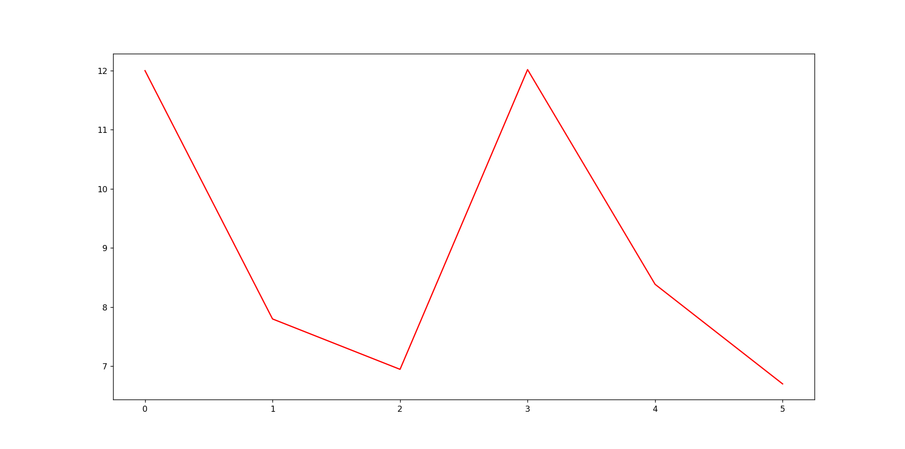

# Assignment-2-Continuous-based Simulation

> * Participant name: Maxwell Stolarenko

This repository is a reupload of a project I worked on as a Modeling and Simulation graduate student at the University of Central Florida to allow for public access. All work shown here was written by me.

## General Introduction
A Continuous-based Simulation of a model systematically solves mathematical representations of dynamic systems. These mathematical equations are usually described by sets of either ordinary or partial differential equations [possibly coupled with algebraic equations]. The equations are simulated on a digital computer by numerical simulation. The most common form for these equations take are *Initial Value Problems* (IVP). Modeling a system frequently requires solving an initial value problem; in this context, the differential initial value is an equation that is an evolution equation specifying how, given initial conditions, the system will evolve with time.

## (Part 1) Numerical Analysis of Initial Value Problems (50 pts)
We will first study the following IVP:
<BR>


Where the initial condition for this ODE is defined by **y(0)=1**


**(a)** Solve for the exact symbolic (analytical) solution. (*Hint: take the integral. -[[use **wolfram alpha**]](https://webcourses.ucf.edu/courses/1409558/pages/wolframalpha-is-your-friend?module_item_id=15869103)*)


Next, plot the exact solution [in red] Python from **x**=[0,5] where **h**=0.25. [This will be 25 *steps* [or values].]


**(b)**  Code the mathematical formulas in Python for *dy_dx* function.
See [functions.py](https://github.com/IDS6145-Fall2022/assignment2-cbs-mstolarenko/blob/main/code/functions.py)


**(c)** Code and plot three numerical integration solutions in **Python** discussed: **RK1**, **RK2**, **RK4**. [We provide some helping templates to use - which you have to use for this assignment.]. Create three plots for this section comparing each numerical solution to the exact solution plotted in part (a). Create one final plot with all four curves above.

#RK1


#RK2


#RK4

**(d)** Pick (and label) three different step sizes (values for **h**). Plot the four graphs from part (c) showing the change between the three step sizes. Discuss what the plots are showing, how does **h** affect the overall accuracy? Is it better to change h or change the numerical solver?

Step Size(1): h = 0.1
Exact:

RK1:

RK2:

RK4:


Step Size(2): h = 0.4
Exact:

RK1:

RK2:

RK4:


Step Size(3): h = 1.0
Exact:

RK1:

RK2:

RK4:


Discussion on Step Size Changing:
As we increase the size of our steps, we see larger and larger gaps between each measured instance. In doing so, the simulation is forced to make broader guesses that may not accurrately reflect the exact value of an initial value problem. Having larger step sizes will provide less accurate estimations of the exact value but come at the benefit of not taking as much time or computing power to run. In reality, however, the effectiveness of discretizing does not function in a vaccuum and ultimately depends on what exactly it is you want to measure. Something that needs percision down to milliseconds would benefit more from smaller step sizes whereas something over the course of hours or even days would yield more meaningful results when using larger step sizes.

**(e)** Here we will look at additional numerical solvers. Differential equations are solved in Python with the Scipy.integrate package using function ODEINT. ODEINT requires three inputs: 
```
y = odeint(model, y0, t)
```
* model: Function name that returns derivative values at requested y and t values as dydt = model(y,t)
* y0: Initial conditions of the differential states
* t: Time points at which the solution should be reported.

* Add functionality for using **odeint** to solve our IVP differential equation. [*Hint there is a Webcourse page to help set up ODEINT*].


## (Part 2) Analyzing and Exploring AIS vessel-traffic Data (30 pts)

Vessel traffic data, or Automatic Identification System (AIS) data, are collected by the U.S. Coast Guard through an onboard navigation safety device that transmits and monitors the location and characteristics of vessels in U.S. and international waters in real-time. Information such as location, time, vessel type, speed, length, beam, and draft is available on the [**https://marinecadastre.gov/ais/**](https://marinecadastre.gov/ais/) website. 

For this part we will be using data from six different days (3 before COVID-19 and 3 during major lockdowns). For example the zip file AIS_2020_01_05 contains a CSV file for Jan 05, 2020. You can read these files into Panda dataframems:

```
df=pd.read_csv("data/AIS_2020_01_18/AIS_2020_01_18.csv")
```

and code to plot different areas.

```
import pandas as pd
import matplotlib.pyplot as plt
from mpl_toolkits.basemap import Basemap

def draw_Map(c1,c2,c3,c4):
    """initialize a basemap centered on the continental USA"""
    plt.figure(figsize=(14, 10))
    return Basemap(projection='lcc', resolution='l',
                   llcrnrlon=c1, urcrnrlon=c2,
                   llcrnrlat=c3, urcrnrlat=c4,
                   lat_1=33, lat_2=45, lon_0=-95,
                   area_thresh=10000)


#m = draw_Map(-90, -74.5, 23.3, 31)  # Florida
#m = draw_Map(-78.0, -71.0, 36.4, 39.6) # Chesapeake Bay
#m = draw_Map(-68.1, -64.2, 17.4, 19.5)  # Puerto Rico
#m = draw_Map(-132.0, -54.0, 15.3, 51)  # USA 
    
# Draw map background
m.fillcontinents(color='white', lake_color='#eeeeee')
m.drawstates(color='gray')
m.drawcoastlines(color='gray')
m.drawcountries(color='lightgray')
m.drawmapboundary(fill_color='#eeeeee')

plt.show()
```
[*you can make these plots look nice - we are just providing base starter code to help*]


**(a)**  Plot, compare and discuss the AIS data before COVID than during the height of COVID-19 for the **m** regions above using the days of data you downloaded. What impacts do you observe?


The first map shows plotted AIS data of every vessel entering and exiting the Florida region over the course of three days in February of 2020 and three days in March of 2020. The dates in February are meant to serve as a baseline for how vessel data should typically appear when global conditions are normal. The dates in March are meant to show the drastic change in behaviors and policies after the emmergence of a global pandemic and the result of several countries enforcing restrictions to trade. Initial impressions on the impact of the March 2020 lockdown are that once the lockdown was announced and put into place, vessel pathing was a lot more chaotic. Normally vessels will travel along set paths that most other vessels would, that is why you see such a strong cluster of vessel data curving around the very bottom of Florida. When Covid happened, many of this thick clusters started to thin out and what you see instead are several thin clusters scattered around the map. This is likely because of vessels arriving at one location only to be turned away because of the lockdown.


The second map shows plotted AIS data of every vessel entering and exiting the Chesapeake Bay region over the course of three days in February of 2020 and three days in March of 2020. Similar to the Florida maps, the month of February saw a high density of vessels along the eastern coast while March of 2020 had thinner but more spread out lines.


The third set of maps show plotted AIS data of every vessel entering and exiting Puerto Rico's coaster borders over the course of three days in February of 2020 and three days in March of 2020. Puerto Rico saw a high density of vessels entering and exiting the region along its eastern coastline, with few vessels entering the western coastline. During March 2020, however, we see fewer clusters of AIS ship data along the eastern coast and no vessels on the western coast at all. Initial impressions on the impacts here suggest that most vessels did not stop to even dock at Puerto Rico's ports at the start of the global lockdown. Few were willing to trade and even fewer were willing to dock.


The fourth set of maps show plotted AIS data of every vessel entering and exiting USA's coaster borders over the course of three days in February of 2020 and three days in March of 2020. While it may not have been as obvious in the above three sets of maps, it is very apparent that the month of March 2020 saw a significant decline in the density of vessels along the coastlines of USA. The clusters of plots on the latter three dates are much thinner than the three dates in February. Biggest impact I see here is that on a global scale, routes still maintain their general shape, but because of so many couuntries locking down their borders and tightening their global policies at around this time, we see a lot less countries using vessels for trading or even trading at all.

**(b)** Filter the dataframe for a single vessel on a pre-covid day. Plot the vessel's path.
Plot the vessel path using both linear (point to point) and a spline method in SciPy.


The following plotted image shows coordinate points for the "Patuxent" vessel on the date of February 5th, 2020, approximately one month prior to border lockdowns from the global pandemic. The following vessel is navigating along the eastern coastline of North America around the Chesapeake region.

**(c)** How would extrapolate where the vessel is heading (or came from)? How would you detect if there was an anomaly or just bad data?

Inferences based on the direction and destination of a plotted vessel can be extrapolated from the overall shape of its travel history. The ship was traveling from Chesapeake to more southern ports in Virginia. The following plotted pathing has a rather solid shape and foundation, indicating that the vessel stayed on a charted course and maintained that route for the entirely of their travel. You can tell that the ship had docked at a port in Virginia and had begun the process of leaving based on the shape.

You could also compare the individual vessel's path to that other other vessels. Seeing as how ships often line up to enter a port, all ships have to follow the same path. A ship going in a path that is uncommon for other ships in that area could show signs that an anomoly occurred in that area. Annomolies may include emergencies that force the ship to go off course or a sudden onset of weather the ship must manuever around.

Bad data, on the other hand, could appear when the AIS tracking a specific vessel experiences technical difficulties. Poor weather or faulty equipment could disrupt the AIS's consistent recordings and leave gaps between recorded intervals.

## (Part 3) Numerical Simulation of the Preditor-Prey Equations (20 pts)

The **Lotka-Volterra** (Preditor-Prey) Equations are a pair of first-order non-linear ordinary differential equations that model a simple Predator-Prey senario. (This is a common input for many Agent-based Models). Here x represents a population of (machine) *pal* robots - the predators, and y represents a population of humans (*The [**Mitchells**](https://www.imdb.com/title/tt7979580/)*) - the prey.


Here a,b,c,d are constant (positive number) parameters. (For the homework a=b=c=d=1)

**(a)** Here simulate in **python** and plot the population dynamics for t=<0,20> for h=0.1 at population_0=[2.0, 1.0] - where population_0 contains the intial values [x0,y0]. (Use one of the 4 numerical simulators from above for the simulation.)


**(b)** Now plot in Python Robots (x axis) vs Humans (y axis)
Change the intial values , a=b=c=d= [v1,v2,v3] and show the change in values.

Initial Value v1=2


Initial Value v2=5


Initial Value v3=10


**(c)** Simulate and plot this in **AnyLogic**.<BR>
<BR>

**(d)** Compare your results to your Python implementation and also show the plots for the three different intial values for a,b,c,d that you choose. [*these can be seperate plots in AnyLogic.*]


AnyLogic gives us the opportunity to modify initial values and see how it changes a system's dynamic in real time. Similar to what we saw with an initial value of 1, an initial value of 2 produces a graph very similar. The major difference between this initial value's graph and the initial value of 1 is that the values are much more tightly packed together while also having slightliy higher spikes. Such observations indicate increasing the initial value may make the dynamic more unstable.


With AnyLogic we can test how manipulating the initial value for a=b=c=d=i can quickly make a dynamic system unstable. While both x and y had relatively similar y-axis values as time increased with the initial values 1 and 2, setting an initial value of 5 quickly creates a larger dispairity between the two functions. What was once a relatively unchanging value, the two functions gradually increase in value over time.


With AnyLogic we can see what setting a high initial value would do to the system dynamic. At an initial value of 10, the system has become completely unstable and nothing like it's original initial value. X and Y are no longer alligned and create exponentially higher and higher max points as the simulation continues to run.
